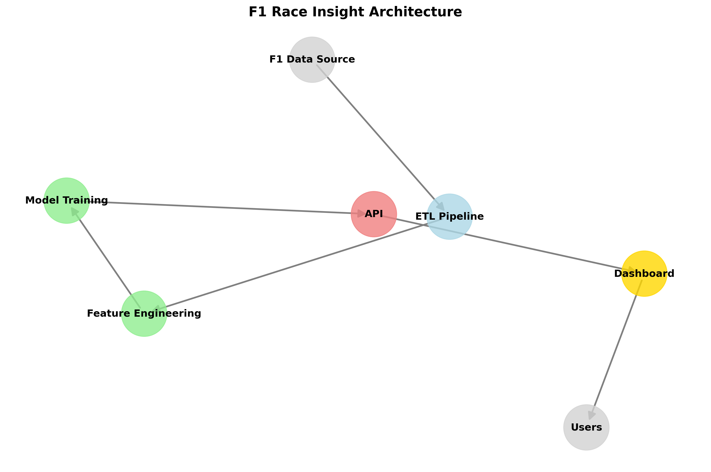

# F1 Race Insight Predictor

[](https://github.com/hadiahmed13/f1-race-insight/actions)
[](https://codecov.io/gh/hadiahmed13/f1-race-insight)
[](https://opensource.org/licenses/MIT)
[](https://github.com/hadiahmed13/f1-race-insight/releases)

Machine learning-powered API for predicting safety car deployments in Formula 1 races. Analyze race telemetry, track conditions, and driver behavior to forecast lap-by-lap risk.

## Architecture



The system consists of four main components:
1. **ETL Pipeline**: Fetches and processes F1 race telemetry data using FastF1
2. **Feature Engineering & Model Training**: Creates features and trains an XGBoost classifier
3. **API**: Flask-based REST API for predictions
4. **Dashboard**: Streamlit visualization interface

## Features

- 📊 Pull Formula 1 telemetry data from 2020-2024 seasons using FastF1
- 🔄 ETL pipeline with feature engineering producing tidy Parquet datasets
- 🧠 XGBoost binary classifier that predicts safety car deployment with ≥0.81 AUC ROC
- 🚀 REST API with predict and health endpoints
- 📈 Interactive Streamlit dashboard with track map, risk charts, and SHAP explanations
- 🤖 Automated ETL and model retraining on GitHub Actions
- 🧪 Comprehensive test suite with >90% coverage

## Quick Start

### Installation

```bash
# Clone the repository
git clone https://github.com/hadiahmed13/f1-race-insight.git
cd f1-race-insight

# Install dependencies
make setup

# Run ETL pipeline (downloads F1 telemetry data)
make etl

# Train the model
make train

# Start the API
make api
```

### Using the API

```python
import requests

# Make a prediction for a specific lap
response = requests.post(
    "http://localhost:5000/api/v1/predict",
    json={
        "race_id": "2023_05_Monaco",
        "lap": 23,
        "lap_data": {
            "Driver": "VER",
            "Team": "Red Bull Racing",
            "Compound": "HARD",
            "TyreLife": 15,
        }
    }
)

# Parse the response
result = response.json()
print(f"Safety car deployment probability: {result['probability']:.2f}")
print(f"Will deploy safety car: {result['will_deploy_sc']}")
```

### Dashboard

To run the Streamlit dashboard:

```bash
make dashboard
```

Then open your browser at http://localhost:8501

## Development

### Prerequisites

- Python 3.11+
- Poetry
- Make (optional, for convenience commands)

### Environment Setup

```bash
# Using Poetry (recommended)
poetry install

# Using pip (alternative)
pip install -r requirements.txt
```

### Development Workflow

1. Make changes to the codebase
2. Run linting and tests: `make lint test`
3. Format code: `make format`
4. Start the application: `make start`

### Using pre-commit hooks

```bash
make pre-commit-setup
```

## CI/CD Pipeline

The project uses GitHub Actions for CI/CD:

- `ci.yml`: Runs on push and pull requests to main branch
  - Runs linting, tests, and code coverage checks
  - Builds Docker image

- `etl_retrain.yml`: Runs on a weekly schedule (Saturday 03:00 UTC)
  - Fetches latest F1 data
  - Retrains model
  - Deploys to Heroku if model meets performance criteria

## Documentation

- [API Documentation](/docs/openapi.yaml) - OpenAPI v3 specification
- [Architecture Overview](/docs/architecture.md) - Detailed component diagram
- [Data Dictionary](/docs/data_dictionary.md) - Description of dataset fields
- [Model Card](/docs/model_card.md) - Model details and performance metrics

## Deployment

The application is deployed to Heroku using Docker containers:

```bash
# Manual deployment
heroku container:push web --app your-app-name
heroku container:release web --app your-app-name
```

## License

This project is licensed under the MIT License - see the [LICENSE](LICENSE) file for details.

## Acknowledgments

- [FastF1](https://github.com/theOehrly/Fast-F1) for providing F1 telemetry data
- [XGBoost](https://xgboost.readthedocs.io/) for the gradient boosting framework
- [Streamlit](https://streamlit.io/) for the interactive dashboard framework
- [SHAP](https://github.com/slundberg/shap) for model interpretability 